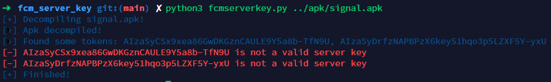

# fcm_server_key
A simple script to extract &amp; validate google fcm server keys from apk file.

Based on [Abss's](https://twitter.com/absshax) research about Firebase Cloud Messaging Service Takeover: 
https://abss.me/posts/fcm-takeover/

## Pre-requisite
Apktool needs to be installed before running this script

Reference: https://ibotpeaches.github.io/Apktool/install/

## Usage
